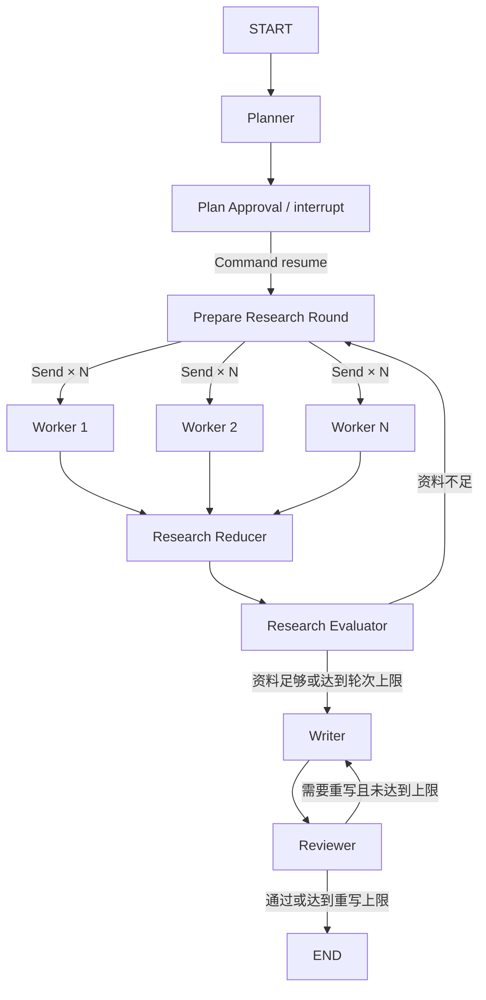

# Mini Research Agent

> 基于 LangGraph 的可恢复深度研究工作台：规划研究任务、人工审批、并行联网检索、资料评估、报告生成、质量审核，以及 Checkpoint 时间旅行。

[](https://www.python.org/)
[](https://github.com/langchain-ai/langgraph)
[](https://fastapi.tiangolo.com/)
[](https://vuejs.org/)

Mini Research Agent 不是一个只展示 `graph.add_node()` 的聊天机器人 Demo。它围绕真实研究任务实现了一条完整工作流，并把 LangGraph 中最值得学习和落地的能力组合在一起：动态 Map-Reduce、持久化中断、并行分支、失败恢复、循环路由、人工介入、成本保护和历史状态分支。

项目同时提供 Vue Web 工作台和 Python CLI。Web 用户在页面中填写自己的 OpenAI 或 DeepSeek API Key。Key 会通过网络发送到 FastAPI 服务端，并以明文存在于该进程的会话内存中；因此当前 BYOK 方案只适合自托管或你信任的服务端，不应把 Key 提交给不受信任的公共实例。

> [!IMPORTANT]
> 仓库当前还没有 `LICENSE`。在添加许可证前，代码在法律意义上不是可自由复制、修改和分发的开源软件。计划公开发布时，应先选择 MIT、Apache-2.0 等合适许可证。

> [!WARNING]
> 当前版本定位为学习与单机验证项目，还不是可直接运营的多租户 SaaS。它尚未实现登录鉴权、线程所有权、分布式凭据存储和生产级数据库，部署边界见[已知限制](#已知限制)。

## 功能特性

- **研究规划**：Planner 将主题拆分为 3～6 个可检索任务。
- **人工审批**：使用 LangGraph `interrupt()` 暂停，支持批准或修改计划。
- **并行检索**：通过动态 `Send` 并发执行多个 Research Worker。
- **联网研究**：支持 OpenAI Responses API Web Search；DeepSeek 在所用端点与模型提供兼容的 `web_search` 工具时可用。
- **资料评估**：按覆盖度、可靠性、时效性和证据充分度打分；不足时自动补充研究。
- **报告闭环**：Writer 生成 Markdown 报告，Reviewer 评分并驱动有限次数重写。
- **实时工作台**：通过 SSE 展示节点状态、Worker 进度、模型输出和 Writer 流式内容。
- **持久化恢复**：SQLite Checkpointer 保存 State、待执行节点和中断状态。
- **时间旅行**：查看历史 Checkpoint，修改计划或证据，并从修改点创建独立分支。
- **资料审查**：按 Worker 查看研究正文、来源 URL、Evaluator 意见和结构性风险提示。
- **容错保护**：节点级重试、指数退避、超时、调用次数、搜索轮数、Token 和费用限制。
- **BYOK 配置**：每个浏览器会话自行配置 Provider、模型和 API Key。

## 工作流



并行 Worker 只返回局部 State 更新。`research_results` 和 `usage_events` 使用 Reducer 合并；Reducer 再按 `run_id`、研究轮次和任务序号筛选排序，避免并行完成顺序影响报告内容。

## 技术栈

| 层级 | 技术 |
| --- | --- |
| 工作流 | LangGraph 1.2 |
| LLM 接入 | OpenAI Python SDK，OpenAI / DeepSeek |
| API | FastAPI + SSE Starlette |
| 持久化 | LangGraph SQLite Checkpointer |
| 前端 | Vue 3、Pinia、Vite、Tailwind CSS、Ant Design Vue |
| 测试 | Python `unittest`、FastAPI TestClient、Vite production build |

## 快速开始

推荐先使用 Web 工作台：LLM 配置由每个浏览器会话在页面中填写。CLI 是另一条独立入口，只读取 `.env`；页面中保存的 Key 不会自动提供给 CLI。

### 环境要求

- Python 3.11+
- Node.js 18+
- OpenAI 或 DeepSeek API Key

### 1. 克隆项目

```bash
git clone https://github.com/zhangxiang87212/langgragh-study-v1.git
cd langgragh-study-v1
```

### 2. 安装后端依赖

```bash
python3 -m venv .venv
source .venv/bin/activate
python -m pip install -r requirements.txt
cp .env.example .env
```

Windows PowerShell 使用：

```powershell
py -3 -m venv .venv
.venv\Scripts\Activate.ps1
python -m pip install -r requirements.txt
Copy-Item .env.example .env
```

`.env` 默认只负责 Checkpoint、重试和预算等服务端配置。使用 Web 页面时，不需要把 LLM API Key 写入 `.env`。

### 3. 启动后端

```bash
uvicorn app.server:app --reload --port 8011
```

API 文档：<http://127.0.0.1:8011/docs>

另开终端确认服务可访问：

```bash
curl http://127.0.0.1:8011/api/config
```

首次启动返回 `"configured": false` 是正常现象，模型配置将在页面中完成。

### 4. 安装并启动前端

另开一个终端：

```bash
cd frontend
npm ci
npm run dev
```

访问 <http://localhost:5173>。首次进入会自动显示“模型连接设置”。选择 OpenAI 或 DeepSeek，填写 API Key 和模型名称，保存后即可发起研究。

> [!CAUTION]
> 真实研究会调用付费 API。默认最多允许 30 次 LLM 调用，而 Token 和费用上限默认为不限制。第一次试跑建议先在 `.env` 中设置 `LLM_MAX_CALLS=10`、`SEARCH_MAX_ROUNDS=1` 和 `LLM_MAX_TOTAL_TOKENS=50000`；费用仍以 Provider 账单为准。

## 页面使用

1. 在模型设置中选择 Provider 并填写自己的 API Key。
2. 点击“发起新研究”，输入研究主题。
3. 查看 Planner 生成的计划，批准或修改任务。
4. 实时观察并行 Worker、资料评分、Writer 和 Reviewer。
5. 在任务侧栏切换历史研究线程。
6. 打开“时间旅行 & 审查”，查看历史 Checkpoint、资料来源或创建修正分支。

页面顶部的模型状态可用于重新配置或清除当前会话密钥。保存配置只做格式校验，不会产生一次额外的付费模型调用；无效 Key 会在第一次实际研究请求时由 Provider 返回错误。

## 模型配置与密钥安全

Web 端采用 BYOK（Bring Your Own Key）模式：

- API Key 会通过网络传到 FastAPI，并以明文保存在该进程内存中；服务端运营者和同进程代码在技术上可以读取它。
- 浏览器仅持有一个随机的 `HttpOnly`、`SameSite=Strict` 会话 Cookie。
- 本项目的应用代码不会主动把 API Key 写入 localStorage、SQLite、Checkpoint、报告或应用日志。
- API 响应不会返回 API Key；配置对象的字符串表示也会隐藏密钥。
- 不同浏览器会话相互隔离。
- 会话最长保留 12 小时，后端进程重启后立即失效。
- 未配置模型的浏览器不能启动或恢复会产生 LLM 调用的工作流。

这些措施不能防御恶意服务端运营者、被入侵的进程、内存转储、前端 XSS，或错误记录请求头/请求体的反向代理。请只在自托管或明确可信的服务端上输入 Key，并检查网关与 APM 的日志脱敏设置。

公网部署必须使用 HTTPS，并设置：

```dotenv
CORS_ALLOWED_ORIGINS=https://research.example.com
LLM_SESSION_COOKIE_SECURE=true
```

当前内存凭据存储面向本地和单 Worker 部署。多 Worker 部署需要改用带 TTL 的共享秘密存储、会话粘滞或等效方案。现有研究线程 API 也不提供用户级权限隔离；部署公共 SaaS 前必须增加登录鉴权和线程所有权校验。

## Provider 配置

### OpenAI

| 字段 | 默认值 | 用途 |
| --- | --- | --- |
| 生成模型 | `gpt-5-mini` | Planner、Evaluator、Writer、Reviewer |
| 搜索模型 | `gpt-5.4-mini` | Research Worker 和 Web Search |

### DeepSeek

| 字段 | 默认值 | 用途 |
| --- | --- | --- |
| 模型 | `deepseek-v4-flash` | 所有 LLM 节点 |
| Base URL | `https://api.deepseek.com` | DeepSeek API 地址 |

Research Worker 会向 DeepSeek Responses API 发送 `tools=[{"type": "web_search"}]`，当前没有“模型不支持搜索时自动降级”的逻辑。因此，所选模型、账户和 Base URL 必须实际支持该工具；否则任务会在 Research Worker 阶段失败。可以先运行[真实 DeepSeek 手动测试](#测试)验证当前配置。

如果修改 DeepSeek Base URL，服务端会向该地址发送 API Key。只应填写自己信任的 HTTPS 服务。

## 环境变量

完整模板见 [.env.example](./.env.example)。常用服务端配置如下：

| 变量 | 默认值 | 说明 |
| --- | --- | --- |
| `CHECKPOINT_BACKEND` | `sqlite` | `sqlite` 或 `memory` |
| `CHECKPOINT_DB_PATH` | `checkpoints/research.sqlite` | SQLite Checkpoint 文件 |
| `LLM_RETRY_MAX_ATTEMPTS` | `3` | 最大尝试次数，包含第一次调用 |
| `LLM_NODE_TIMEOUT_SECONDS` | `120` | 单节点调用超时 |
| `LLM_MAX_CALLS` | `30` | 单次 run 最大 LLM 调用数 |
| `SEARCH_MAX_ROUNDS` | `3` | 最大研究轮数 |
| `LLM_MAX_TOTAL_TOKENS` | `0` | Token 上限，`0` 表示不限制 |
| `LLM_MAX_COST_USD` | `0` | 费用上限，`0` 表示不限制 |
| `CORS_ALLOWED_ORIGINS` | 本地 Vite 地址 | 允许携带凭据的前端 Origin |
| `LLM_SESSION_COOKIE_SECURE` | `false` | HTTPS 部署时设为 `true` |

Token 使用量目前通过 `ceil(文本字符数 / 3)` 统一估算。费用由用户配置的每百万 Token 单价计算，最终账单应以 Provider 为准。

## CLI 使用

CLI 适合学习 LangGraph、自动化脚本和故障排查。它只从 `.env` 读取 LLM 配置，不复用 Web 页面中的会话配置。取消 [.env.example](./.env.example) 中一组 Provider 配置的注释，并填写真实 Key，例如：

```dotenv
LLM_PROVIDER=deepseek
DEEPSEEK_API_KEY=your_deepseek_api_key_here
DEEPSEEK_MODEL=deepseek-v4-flash
DEEPSEEK_BASE_URL=https://api.deepseek.com
```

如使用 OpenAI，则配置 `LLM_PROVIDER=openai`、`OPENAI_API_KEY`、`OPENAI_MODEL` 和 `OPENAI_SEARCH_MODEL`。

创建任务：

```bash
python -m app.main run "研究 AI Agent 在教育领域的应用趋势"
```

命令会打印新生成的 `thread_id`。计划审批时进程正常退出，之后使用该 ID 恢复；任务完成后，最终报告写入 `outputs/research-report-RUN_ID.md`。

批准计划并继续：

```bash
python -m app.main resume --thread-id THREAD_ID --approve
```

修改计划：

```bash
python -m app.main resume \
  --thread-id THREAD_ID \
  --plan "研究官方文档；查找生产案例；总结风险"
```

查看状态和历史：

```bash
python -m app.main status --thread-id THREAD_ID
python -m app.main history --thread-id THREAD_ID
```

审查指定 Checkpoint：

```bash
python -m app.main inspect \
  --thread-id THREAD_ID \
  --checkpoint-id CHECKPOINT_ID \
  --output outputs/checkpoint-review.md
```

从历史状态创建资料修正分支：

```bash
python -m app.main fork \
  --thread-id THREAD_ID \
  --checkpoint-id CHECKPOINT_ID \
  --remove-source "https://wrong.example/article" \
  --remove-text "需要删除的错误结论" \
  --evidence "人工核验资料及来源 https://official.example/data"
```

修改计划的分支从 `prepare_research` 继续；修改资料的分支从 `research_evaluator` 继续。修改点之前的 Planner 或 Research Worker 不会重新调用。

## Checkpoint 与时间旅行

每个 Checkpoint 保存：

- 当前 State 值；
- 接下来要执行的节点；
- 当前 step 和 checkpoint ID；
- 并行任务及中断恢复信息。

`thread_id` 标识一条可恢复的执行历史，`run_id` 标识一次业务执行。时间旅行不会覆盖原线程，而是复制历史 State、生成新的 `thread_id` 和 `run_id`，再通过 `graph.update_state(..., as_node=...)` 告诉 LangGraph 从哪个后继节点继续。

资料修正支持：

- 删除错误来源 URL；
- 删除错误正文；
- 补充人工证据；
- 重新运行 Evaluator、Writer 和 Reviewer；
- 保留真正复用的历史用量。

## 容错与预算

所有付费模型节点都配置 LangGraph `RetryPolicy`。瞬时错误包括连接失败、超时、限流、HTTP 408/409/429 和 5xx；参数或数据校验等永久错误不会重试。

预算路由会在开始下一批调用前检查：

- 最大 LLM 调用次数；
- 最大搜索轮数；
- 估算 Token；
- 估算费用。

预算不足时工作流进入 `budget_exhausted`，生成带明确原因的终止结果，不再发起新的付费调用。最终报告使用稳定的 `run_id` 文件名和原子写入，恢复任务不会重复覆盖已经提交的报告。

## API 概览

启动后可在 `/docs` 查看完整 OpenAPI 文档。

| 方法 | 路径 | 说明 |
| --- | --- | --- |
| `GET` | `/api/config` | 获取当前会话的公开模型配置 |
| `PUT` | `/api/config` | 保存当前会话的模型和 API Key |
| `DELETE` | `/api/config` | 清除当前会话密钥 |
| `POST` | `/api/research/run` | 初始化新的研究线程 |
| `GET` | `/api/research/threads` | 获取研究线程列表 |
| `GET` | `/api/research/{thread_id}/status` | 获取最新 State |
| `GET` | `/api/research/{thread_id}/history` | 获取 Checkpoint 历史 |
| `GET` | `/api/research/{thread_id}/inspect` | 审查历史资料和来源 |
| `POST` | `/api/research/fork` | 创建时间旅行分支 |
| `GET` | `/api/research/{thread_id}/stream` | 通过 SSE 执行并推送事件 |

## 项目结构

```text
.
├── app/
│   ├── api.py                # FastAPI 路由与 SSE
│   ├── checkpoints.py        # Checkpointer 配置
│   ├── config.py             # 环境和页面配置校验
│   ├── graph.py              # LangGraph 拓扑与路由
│   ├── inspection.py         # Checkpoint 资料审查
│   ├── llm.py                # OpenAI / DeepSeek 适配器
│   ├── nodes.py              # Graph 节点实现
│   ├── resilience.py         # 重试、超时、预算和用量
│   ├── state.py              # State、Worker State、Reducer
│   ├── time_travel.py        # 历史 State 修正与分支
│   └── web_llm_config.py     # 浏览器会话密钥存储
├── frontend/                 # Vue 3 Web 工作台
├── tests/                    # 单元和集成测试
├── .env.example              # 非敏感配置模板
└── requirements.txt
```

更详细的阶段实现原理、State 演进和代码学习顺序见 [README_old.md](./README_old.md)。

## 测试

默认自动化测试套件不会调用真实 LLM：

```bash
source .venv/bin/activate
python -m unittest discover -v
```

前端生产构建：

```bash
cd frontend
npm run build
```

真实 DeepSeek Web Search 测试默认跳过，因为会消耗 API 额度。先在 `.env` 中配置 `LLM_PROVIDER=deepseek` 和 `DEEPSEEK_API_KEY`，再显式启用：

```bash
RUN_DEEPSEEK_RESEARCH_MANUAL_TEST=1 \
python -m unittest -v tests.test_deepseek_research_manual
```

## 部署边界

当前仅支持本地或可信网络中的单进程部署，不提供经过验证的生产部署方案。如果准备对公网开放，至少需要完成：

- 使用 HTTPS，并启用 Secure Cookie。
- 不要把 `.env`、Checkpoint 数据库或报告输出提交到 Git。
- 通过反向代理统一提供前端和 `/api`，或严格配置 CORS Origin。
- 单机 SQLite 适合学习和单进程部署；多实例部署应使用生产级共享 Checkpointer。
- 多 Worker 需要共享的短期秘密存储，不能直接使用当前进程内字典。
- 公共服务必须增加认证、授权、速率限制、CSRF 防护和线程所有权校验。
- Provider Base URL 属于服务端出站地址；开放自定义地址前应评估 SSRF 风险。

## 常见问题

| 现象 | 检查项 |
| --- | --- |
| 页面一直显示“未配置” | 打开顶部模型设置，保存 Provider、模型和 API Key；再检查浏览器是否允许会话 Cookie。 |
| 前端无法连接后端 | 确认后端监听 `8011`、前端监听 `5173`，并检查 `CORS_ALLOWED_ORIGINS`。 |
| Provider 返回 401/403 | 检查 Key、账户权限、余额以及所选模型是否可用。 |
| Research Worker 搜索失败 | 确认所选模型、账户和端点支持 Responses API 的 `web_search` 工具；当前没有无搜索降级。 |
| SQLite locked 或多实例状态不一致 | 停止多进程共享本地 SQLite；当前版本按单进程运行。 |

## 已知限制

- 尚无 `LICENSE`，因此当前不能按开源许可证复制、修改或分发。
- API 没有登录鉴权和线程所有权校验，不适合多租户或不可信公网环境。
- API Key 会存在服务端进程内存中；多 Worker 之间不共享会话凭据。
- SQLite Checkpointer 和本地报告文件面向单机运行，不提供多实例一致性。
- Token 与费用是字符数估算值，不等同于 Provider 最终账单。
- 资料评估是模型辅助的结构性检查，不保证来源可访问、事实真实或引用完全一致。
- 仓库暂未提供官方 Docker 镜像、迁移机制、监控告警或生产运维承诺。

## 贡献

许可证确定后，项目计划正式接受代码贡献。在此之前，可以通过 Issue 提交不包含敏感信息的问题描述和改进建议，但请不要假定代码已经获得复制、修改或再分发授权。

添加许可证并开放贡献后，提交内容应遵循以下约定：

1. 保持节点函数只返回 State 更新，避免在节点内部产生不可恢复的副作用。
2. 新功能应补充不调用真实付费模型的自动化测试。
3. 运行后端测试和前端构建。
4. 在 Pull Request 中说明 State、Checkpoint、预算和恢复语义是否发生变化。

仓库当前还没有私密安全报告渠道。公开发布前应增加 `SECURITY.md` 并启用 GitHub Private Vulnerability Reporting。在此之前，请勿在公开 Issue 中粘贴 API Key、访问令牌、私有 URL 或包含敏感研究资料的 Checkpoint。

## Roadmap

- [ ] 用户登录、线程所有权和团队空间
- [ ] PostgreSQL Checkpointer 与多 Worker 部署
- [ ] Redis/Vault 等共享短期秘密存储
- [ ] Provider 连通性测试和模型能力探测
- [ ] URL 可访问性、来源可信度和引用一致性检查
- [ ] 更精确的 Provider Token 与费用统计
- [ ] OpenTelemetry / LangSmith 可观测性
- [ ] Docker 和一键部署模板

## License

仓库当前尚未包含开源许可证。在添加明确的 OSI 批准许可证之前，代码默认仍受版权保护，其他人没有自动获得复制、修改或再分发授权。正式公开发布前，请先选择并添加合适的 `LICENSE` 文件（例如 MIT、Apache-2.0 或其他符合项目目标的许可证）。

## 致谢

- [LangGraph](https://github.com/langchain-ai/langgraph)
- [FastAPI](https://fastapi.tiangolo.com/)
- [Vue.js](https://vuejs.org/)
- [OpenAI](https://platform.openai.com/docs/)
- [DeepSeek](https://api-docs.deepseek.com/)
